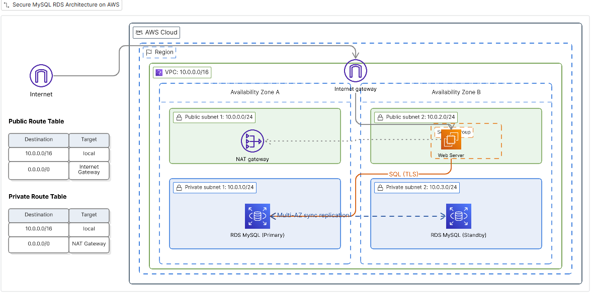

# 🚀 Secure MySQL Deployment on AWS using Amazon RDS in a Custom VPC.
📌 Project Overview
Designed and deployed a secure, highly available MySQL database architecture on Amazon Web Services using Amazon RDS within a custom-built VPC.
The goal is to build a secure, production-style architecture where:
  - The database is not exposed to the internet 
  - Access is controlled through a web server (bastion host) 
  - The setup supports high availability using Multi-AZ deployment
---
## 🧠 Why Use a VPC?
A VPC is critical because it allows you to:
- 🔐 Isolate your database in private subnets
- 🎛️ Control traffic using security groups and route tables
- 🛡️ Add an extra security layer with Network ACLs
- 🌍 Enable Multi-AZ deployments for high availability
---
## 🏗️ Architecture Overview


---
## 🧱 Step 1: Create a VPC
Go to the **AWS Management Console**
Search for **VPC** and open the dashboard
Click **Create VPC**
Configure:
- Name: *RDS-VPC*
- IPv4 CIDR: *10.0.0.0/16*
- IPv6: *None*
- Tenancy: *Default*

Click **Create VPC**

✅ Your network foundation is now ready.

---
## 🔐 Step 2: Create Security Groups
Security groups act as **virtual firewalls**.

🔹 Web Server Security Group
Go to **Security Groups** → Create

Configure:
- Name: *Web-Server-SG*
- VPC: *RDS-VPC*

**Inbound Rules**:
- HTTP (80) → Anywhere (0.0.0.0/0)
- SSH (22) → Anywhere (0.0.0.0/0)

👉 This allows web access and SSH login

🔹 RDS Database Security Group

Create another security group:
- Name: *RDS-DB-SG*
- VPC: *RDS-VPC*
  
**Inbound Rule**:
- MySQL (3306)
- Source: Web Server Security Group
  
👉 This ensures:

✔ Only the web server can access the database

❌ No direct public access

---
## 🌐 Step 3: Create Subnets
You will create **4 subnets** across **2 Availability Zones**.
 
- Public Subnet 1	    10.0.0.0/24	  AZ-1
- Private Subnet 1	  10.0.1.0/24	  AZ-1
- Public Subnet 2	    10.0.2.0/24	  AZ-2
- Private Subnet 2	   10.0.3.0/24	AZ-2
  
👉 Public subnets = Internet-facing

👉 Private subnets = Database layer

---
## 🌍 Step 4: Create an Internet Gateway
Go to **Internet Gateways**

Click **Create**

- Name: *IGW-VPC*

Attach it to your VPC *(RDS-VPC)*

👉 This enables internet access for public resources.

---
## 🔄 Step 5: Create a NAT Gateway
Go to **NAT Gateways** → Create

Configure:
- Name: *VPC-NAT*
- Subnet: *Private Subnet*
- Allocate *Elastic IP*
  
👉 NAT Gateway allows private subnets to:

•	Access the internet (updates, patches)

•	Without being publicly exposed

---
## 🛣️ Step 6: Configure Route Tables
For this activity, we need two route tables:

🔹 Public Route Table
- Associate with: **Public Subnets**
- Add route:
0.0.0.0/0 → Internet Gateway

🔹 Private Route Table
- Associate with: **Private Subnets**
- Add route:
  0.0.0.0/0 → NAT Gateway

👉 This ensures:

•	Public resources → Internet access

•	Private resources → Outbound only via NAT

---
## 🖥️ Step 7: Launch a Web Server (EC2)
Now launch an instance using Amazon EC2.

Configuration:
- Name: *Web Server*
- AMI: *Amazon Linux 2023*
- Instance type: *t2.micro*
- VPC: *RDS-VPC*
- Subnet: *Public subnet (select any of the public subnets created)*
- Auto-assign public IP: *Enabled*
- Security Group: *Web-Server-SG*

## EC2 User Data Configuration

Paste the following script into the **User data** field under **Advanced details** in the [AWS EC2 Launch Wizard](https://docs.aws.amazon.com/AWSEC2/latest/UserGuide/user-data.html).

```bash
#!/bin/bash
# Update and install dependencies
yum update -y
yum install -y httpd
systemctl start httpd
systemctl enable httpd

# Create a simple landing page
echo "<h1>Hello from my Webserver </h1>" > /var/www/html/index.html
```
👉 Acts as a **bastion host**. 

---
## 🗄️ Step 8: Create MySQL Database (RDS) 
## 🔹 Step 8.1: Create DB Subnet Group

Go to **RDS** → Subnet Groups → Create
Name: *Database-Subnet-Group*
Add:
- Private Subnet 1
- Private Subnet 2

👉 Required for Multi-AZ deployment.

## 🔹 Step 8.2: Create RDS Instance
Go to **RDS** → **Create Database**
Select:
- Engine: *MySQL*
- Template: *Dev/Test*
- Deployment: *Multi-AZ*
  
**Configuration**:
- DB Identifier: *rds-instance*
- Username: *admin*
- Password: *(your choice)*
- Instance class: *db.t3.micro*
  
**Connectivity**:
- VPC: *RDS-VPC*
- Public Access: *❌ No*
- Security Group: *RDS-DB-SG*

**Additional:**
- Initial DB: *sales*
- Disable backups
  
👉 Click Create Database

---
## 🪜 Step 9: Connect to the Database Using MySQL Workbench
Once your database has been created in Amazon RDS, it will take a few minutes to fully initialize.

⏳ Wait for Database Availability
- The RDS instance typically takes **~5 minutes** to deploy
- During this time, AWS provisions a **Multi-AZ** setup (primary + standby database)
- Monitor the Status field in the RDS dashboard
  
👉 Proceed once the status changes to **Available (or briefly Modifying)**

 ## 🔎 Retrieve the Database Endpoint
 
Open your **RDS instance** details.

Scroll to the **Connectivity & Security** section.

Copy the **Endpoint**.
Example: *lab-db.cggq8lhnxvnv.us-west-2.rds.amazonaws.com*

## 👉 🔐 Establish a Secure Connection via MySQL Workbench
To securely access the database, we use MySQL Workbench with an SSH tunnel through the EC2 instance.

## 📌 Why SSH Tunneling?
Since the database is in a private subnet, it is not directly accessible from the internet.

👉 Instead:

- You connect to the EC2 instance (public subnet)
- The EC2 instance forwards traffic to the RDS database securely

## ⚙️ Configure a New Connection

Open MySQL Workbench
Click the “+” icon under MySQL Connections

## 🔧 Connection Settings

🔹 **Connection Method**
- Select: Standard TCP/IP over SSH

🔐 **SSH Configuration (EC2 Access)**

- **SSH Hostname:**	              Public IP of your EC2 instance

- **SSH Username:**	              ec2-user
  
- **SSH Key File:**	              Path to your .pem or .ppk key

Example of SSH Key File: *C:\Users\YourName\Downloads\demo-ssh.openssh*. Under this configuration, ensure that your key file is in **OpenSSH format** and points to the correct location on your local machine.

👉 This establishes a secure tunnel to your EC2 instance.

## 🛢️ MySQL Configuration (RDS Access)

-**MySQL Hostname:**	            RDS Endpoint

-**Port:**	            3306

-**Username:**	            Your DB username

-**Password:**            Your DB password

-**Default Schema:**	             Optional (e.g., company)

👉 This connects through the tunnel to your private database.

## 🧪 Test the Connection

Click **“Test Connection”**
Enter your database password if prompted

✅ If successful:

- MySQL Workbench connects to your RDS instance
- You can view and manage your databases

## 🎉 Verification
Once connected:
- You should see the default database *(sales)*
- You can run SQL queries and create additional schemas
  
👉 This confirms:

- Network configuration is correct
- Security groups are properly set
- SSH tunneling is working as expected
  
 *Save this value — it will be used to connect from your application*

## 🎉 Final Outcome
You have successfully built:

✅ A secure AWS architecture

✅ A private MySQL database

✅ Controlled access via EC2

✅ Multi-AZ high availability setup


## 👨‍💻 Author
Rhoda Ndege
